# ponderada_s7

## Projeto de Implementação de API para Gestão de Histórias Integrada com Gemini
&emsp;Este projeto visa a criação de uma API para a gestão de histórias, com integração à API do Gemini para geração automática de conteúdo textual. Abaixo estão os detalhes de cada aspecto do projeto conforme o barema proposto:

### 1. CRUD de Histórias
&emsp; A aplicação oferece operações CRUD (Create, Read, Update, Delete) para gerenciar histórias. Cada história é representada por um modelo que inclui campos como ID e Conteúdo. As operações possibilitam:

**Criação:** Adicionar novas histórias

**Recuperação:** Buscar e visualizar histórias existentes.

**Atualização:** Modificar o conteúdo de histórias existentes.

**Exclusão:** Remover histórias do sistema.

### 2. Integração com a API do Gemini
&emsp; A API integra-se à API do Gemini para gerar histórias de forma dinâmica. A função create_historia_from_gpt é responsável por utilizar a API do Gemini para gerar automaticamente o conteúdo das histórias, facilitando a criação de textos únicos e personalizados.

### 3. Testes unitários
&emsp; Foram implementados testes unitários para garantir a funcionalidade de todas as funções da aplicação.

<h6 align="center"> Figura 1: Create User </h6>
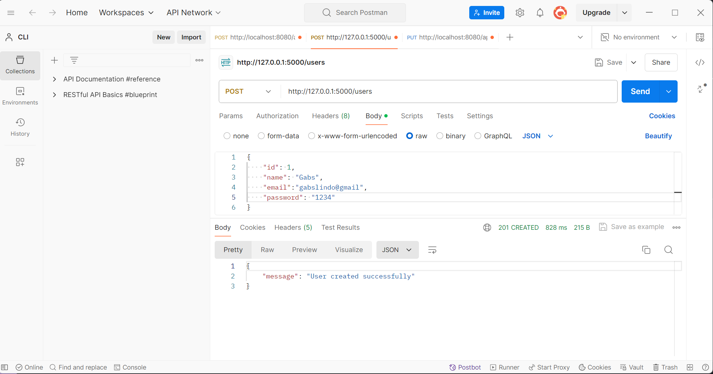

<h6 align="center"> Figura 2: Get User By Id </h6>

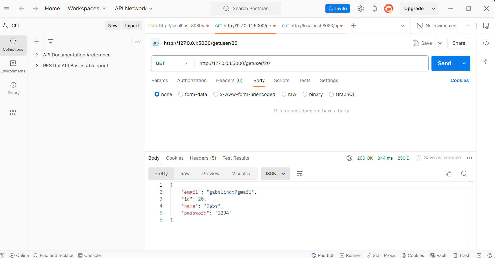

<h6 align="center"> Figura 3: Get All Users </h6>

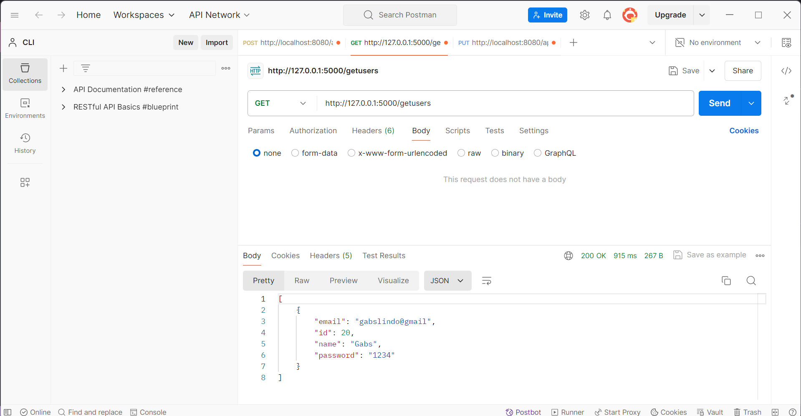

<h6 align="center"> Figura 4: Update User </h6>

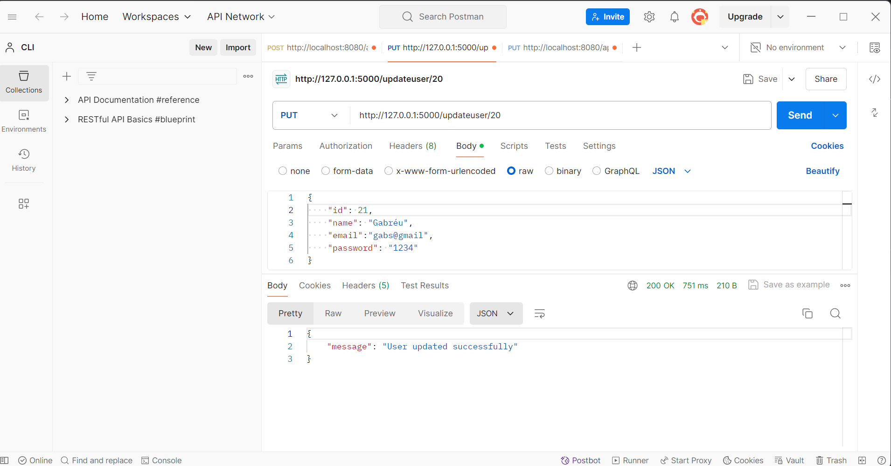

<h6 align="center"> Figura 5: Delete User </h6>

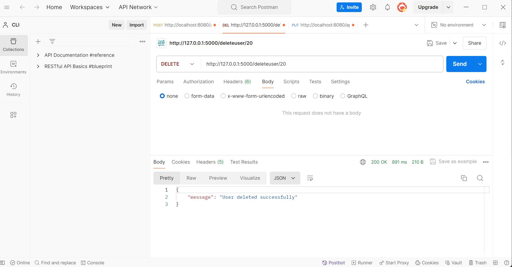

<h6 align="center"> Figura 6: Create História </h6>

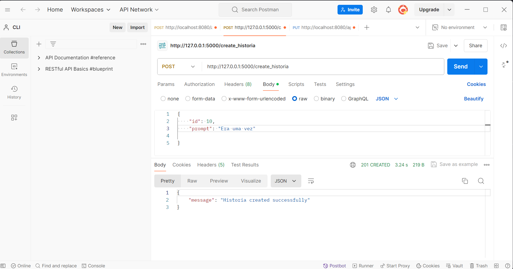

<h6 align="center"> Figura 7: Get História By Id </h6>

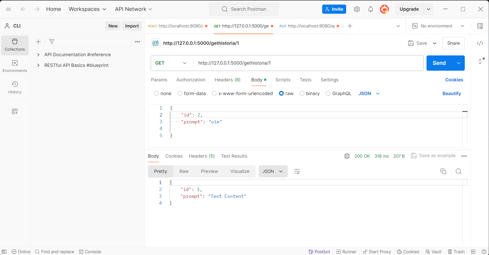

<h6 align="center"> Figura 8: Get All Histórias </h6>

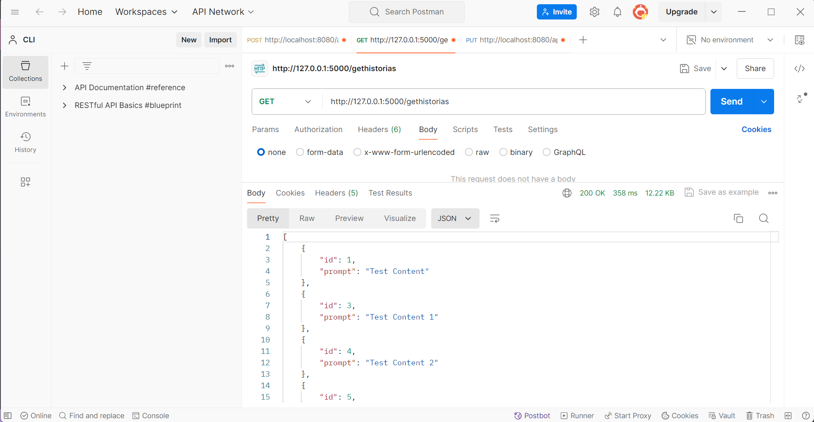

<h6 align="center"> Figura 9: Update História </h6>

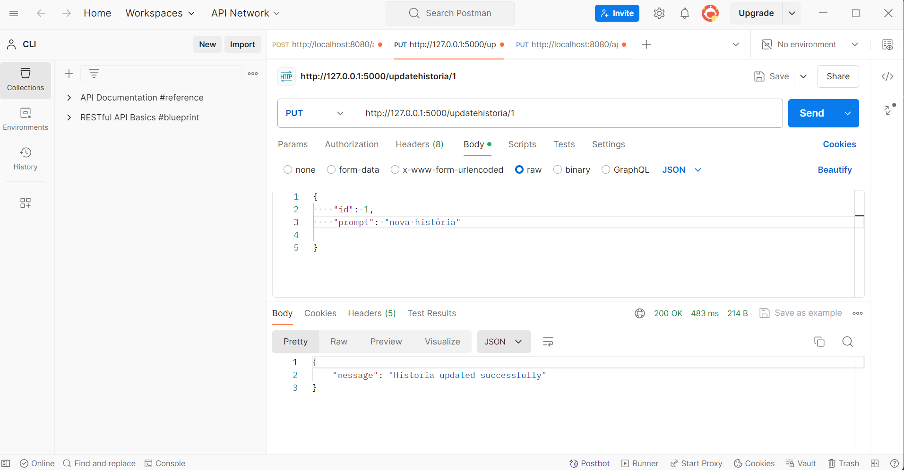

<h6 align="center"> Figura 10: Delete História </h6>

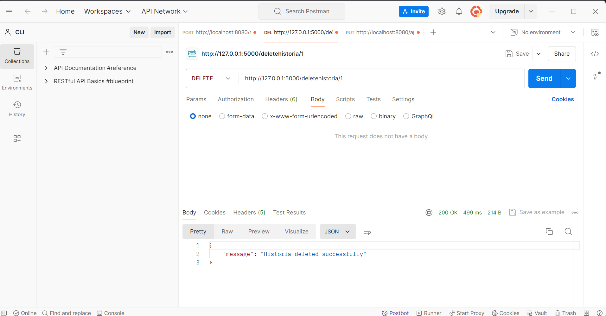

#### 4. Testes Rodando

<h6 align="center"> Figura 11: Testes </h6>

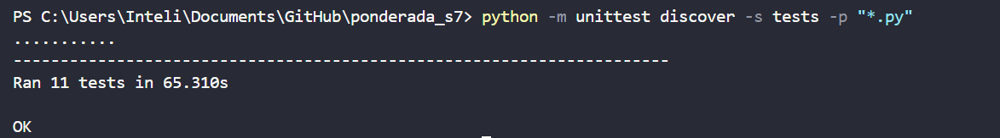